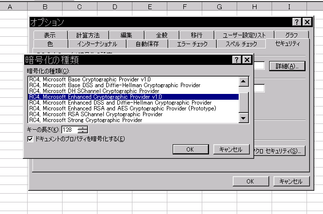

情報の暗号化の標準
======================

Microsoft Office 2002の暗号化
-----------------------------------

2015/07注: RC4 128bit はすでに利用すべきではない暗号となった. 適切な暗号を利用すること

Microsoft Office 2002の暗号化機能はデフォルトでは脆弱(RC4 40bit)だが, 設定によりRC4 128bitを利用できる. Microsoft Office 2002の暗号化機能を用いる場合は設定が必要である.

以下にExcelの場合を示す.

1. 「ツール」-「オプション」を選択
2. 「セキュリティ」タブを選択
3. 「詳細」ボタンを押下
4. 「RC4, Microsoft Enhanced Cryptographic Provider v1.0」を選択
5. キーの長さが128であることを確認

